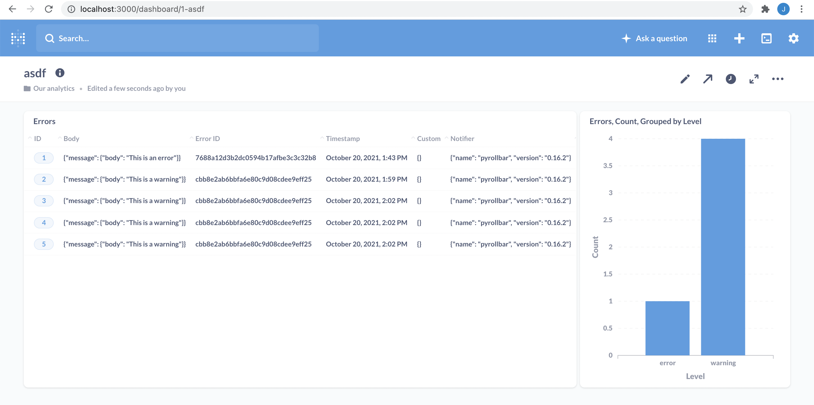

# Errorpush/Metabase/Rollbar PoC

Errorpush[1] is a lightweight error collector which could be used to store
errors and warnings into a postgres database. It's compatible with the
rollbar client[2] and the data could be visualized using Metabase[3].

This proof of concept contains a docker-compose environment to test these
components.


## Installation

Make sure you setup the postgres server first:

```bash
docker-compose up -d postgres
```

After this, you can safely start the other containers:

```bash
docker-compose up -d
```


## Usage

Visit `http://localhost/` for the app to generate `info`, `warning` and `error`
logs and visit `http://localhost:3000/` to create a dashboard in which these
logs are visualized.

This dashboard might look something like this:




## Recommendations

Note that there is no log rotation; logs will be kept forever. Additional code needs to be
written to remove old logs from the database.


## Links

* [1] https://github.com/hauxir/errorpush
* [2] https://github.com/rollbar/pyrollbar
* [3] https://github.com/metabase/metabase
